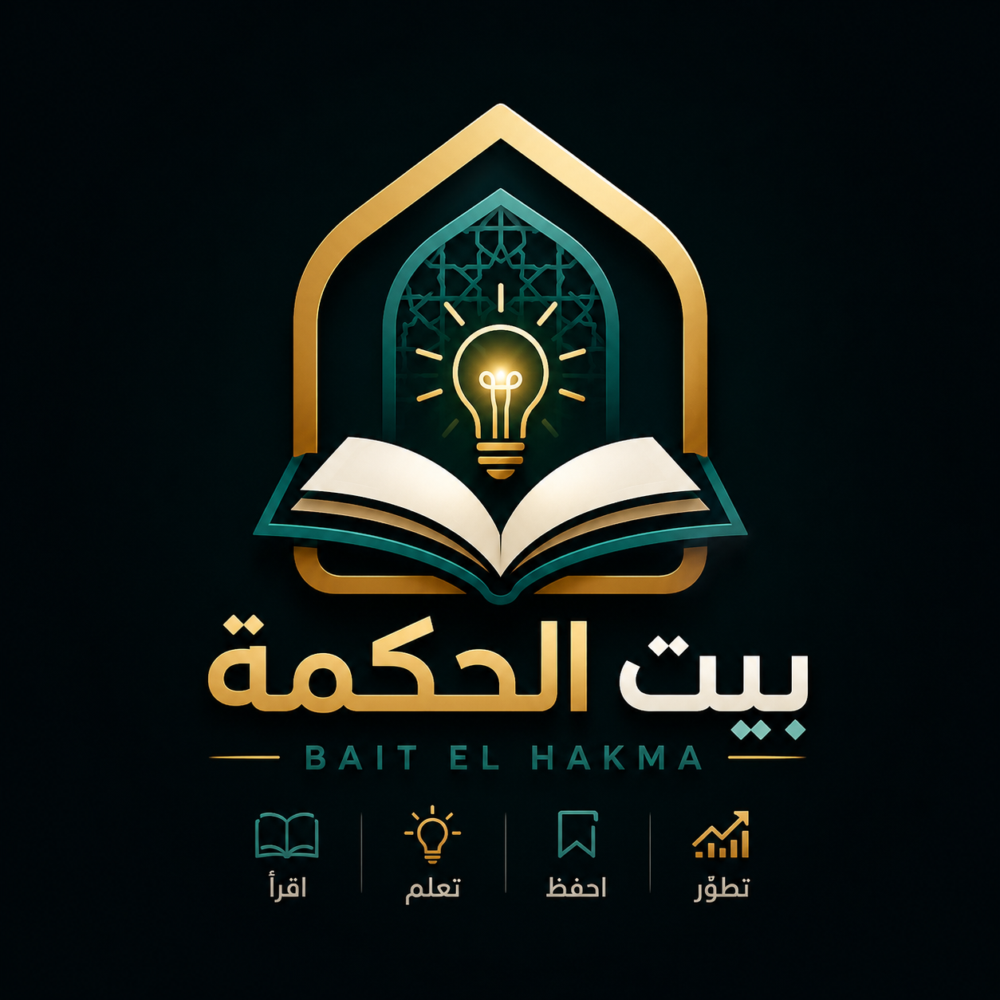

<p align="center">
  
</p>

<h1 align="center">Bait El-Hakma</h1>
<h3 align="center">بيت الحكمة — House of Wisdom</h3>

<p align="center">
  A comprehensive productivity web application with cloud sync, authentication, Quran reader, and beautiful themes.
</p>

<p align="center">
  <a href="https://bait-el-hakma.vercel.app/">
    
  </a>
  <a href="https://github.com/meuor/Bait-El-Hakma">
    
  </a>
</p>

<p align="center">
  
  
  
  
  
  
</p>

---

## Live Demo

**[https://bait-el-hakma.vercel.app/](https://bait-el-hakma.vercel.app/)**

Create an account to sync your data across devices. Your data is securely stored in the cloud.

---

## Features

### Pomodoro Timer
- Customizable focus/break intervals
- Circular SVG progress ring with smooth animations
- Sound notifications
- Session history & daily stats
- Floating mini-player (shows timer across all tabs)

### Focus Video Player
- YouTube & local video support
- Picture-in-Picture mode
- Auto-rotate focus videos (5-min cycle)
- Skip forward/backward controls
- Category filters (Music, Ambient, Focus, Nature)
- 12 curated focus video suggestions
- Floating mini-player across all tabs

### Kanban Board
- Drag & drop cards between columns
- Color-coded labels & priorities
- GTD/PARA style organization
- Custom columns with color picker
- Cloud-synced columns & cards

### Book Library
- Personal reading tracker
- Progress monitoring (0-100%)
- Notes with page numbers
- Tag-based filtering & search
- Cloud-synced books & notes

### Daily Todo
- Priority levels (low/medium/high)
- Dual calendar (Gregorian & Hijri)
- Progress bar with percentage
- Active/Done filters

### Activity Statistics
- Interactive charts (Recharts)
- Pomodoro, task, and reading analytics
- Achievement badges
- Streak tracking

### Motivation & Quran
- **Full Quran Reader** — All 114 Surahs with Arabic text (Alafasy recitation)
- **الورد اليومي (Daily Reading)** — Auto-calculated daily portion to finish Quran in 30 days
- **Last page auto-saved** — Resume reading from where you left off
- **Surah search & filter** — Search by name/number, filter by Meccan/Medinan
- Hadith collection with narrator & source
- Verse of the Day (random Quranic verse)
- Motivational quotes
- Favorites & clipboard copy

### Challenge Tracker
- Custom day-based challenges
- Visual day grid
- Streak calculation
- Multiple challenge support

---

## Authentication & Cloud Sync

Bait El-Hakma features a complete authentication system:

- **Register / Login** with email & password
- **JWT-based** session management
- **Password Reset** via email (6-character code, Resend API)
- **Login error feedback** — red visual indicators for wrong credentials
- **Username system** — choose a username at registration, change every 90 days
- **Public profiles** — share your profile at `bait-el-hakma.vercel.app/@yourusername`
- **Cloud database** (Neon PostgreSQL)
- **Access from any device** by signing in
- **Data migration** tool to import existing local data
- **Cloud sync status** banner — auto-hides after 5 seconds

---

## Themes

5 built-in themes with full dark mode support:

| Theme | Description |
|-------|-------------|
| Light | Clean & bright default |
| Dark | Easy on the eyes |
| Dracula | Vibrant developer theme |
| Monokai | Classic code editor |
| GitHub | GitHub-inspired colors |

---

## Tech Stack

| Layer | Technology |
|-------|-----------|
| Frontend | React 19 + TypeScript 5.9 |
| Build | Vite 7 |
| Styling | Tailwind CSS 3.4 + shadcn/ui |
| State | React Context + useReducer |
| Charts | Recharts |
| Animations | Framer Motion |
| Icons | Lucide React |
| Auth | JWT + bcryptjs |
| Email | Resend API (password reset) |
| Quran API | api.alquran.cloud |
| Database | Neon PostgreSQL (serverless) |
| Hosting | Vercel |

---

## Project Structure

```
Bait-El-Hakma/
├── api/                        # Vercel Serverless Functions (9 endpoints)
│   ├── _lib/                   # Shared utilities (db, auth, email)
│   ├── auth/                   # Auth (register, login, profile, username, public-profile, password reset)
│   ├── kanban/                 # Kanban board CRUD (columns + cards)
│   ├── books/                  # Book library CRUD + notes
│   ├── pomodoro/               # Pomodoro sessions CRUD
│   ├── todos/                  # Daily todos CRUD
│   ├── challenges/             # Challenges CRUD
│   ├── settings/               # User settings (UPSERT)
│   └── migrate/                # Safe data migration (CREATE IF NOT EXISTS)
├── src/
│   ├── components/
│   │   ├── auth/               # LoginForm, RegisterForm, ProfilePage, PublicProfile, ForgotPasswordForm, ResetPasswordForm
│   │   ├── ui/                 # 73+ shadcn/ui components
│   │   ├── QuranReader.tsx     # Full Quran reader (114 surahs, auto-save last page)
│   │   ├── Header.tsx          # Header with cloud sync indicator
│   │   ├── Footer.tsx          # Footer with support links
│   │   ├── MiniPlayer.tsx      # Floating Pomodoro timer + video player
│   │   ├── SyncStatus.tsx      # Cloud sync status banner (auto-hides 5s)
│   │   └── TabNavigation.tsx   # Bottom tab navigation
│   ├── data/
│   │   └── quranData.ts        # All 114 surahs metadata + daily reading calculator
│   ├── context/
│   │   ├── AppContext.tsx       # Central state + API sync
│   │   └── ThemeContext.tsx     # Theme management
│   ├── sections/               # Feature sections
│   │   ├── PomodoroTimer.tsx
│   │   ├── VideoPlayer.tsx
│   │   ├── KanbanBoard.tsx
│   │   ├── BookLibrary.tsx
│   │   ├── DailyTodo.tsx
│   │   ├── ActivityStats.tsx
│   │   ├── Motivation.tsx      # Updated: Hadith, Verse, Quotes, + Quran Reader
│   │   └── ChallengeTracker.tsx
│   ├── lib/
│   │   ├── api.ts              # API client (auth + all CRUD + password reset)
│   │   └── utils.ts            # Utility functions
│   ├── types/index.ts          # TypeScript types
│   └── index.css               # Themes & global styles
├── public/
│   └── logo.png
├── vercel.json                 # Rewrites: /@username, /api/*
├── package.json
└── vite.config.ts
```

---

## Getting Started

### Prerequisites
- Node.js 18+
- Neon PostgreSQL database
- Vercel account
- Resend API key (for password reset emails)

### Local Development

```bash
# Clone the repo
git clone https://github.com/meuor/Bait-El-Hakma.git
cd Bait-El-Hakma

# Install dependencies
npm install

# Create .env file
cp .env.example .env
# Edit .env with your DATABASE_URL and JWT_SECRET

# Start dev server
npm run dev
```

### Environment Variables

| Variable | Required | Description | Where to get |
|----------|----------|-------------|--------------|
| `DATABASE_URL` | Yes | Neon PostgreSQL connection string | [Neon Console](https://console.neon.tech) |
| `JWT_SECRET` | Yes | Secret key for JWT tokens | Generate any secure string |
| `RESEND_API_KEY` | No* | Resend API key for password reset emails | [Resend](https://resend.com) (free: 100/day) |

*\*Without RESEND_API_KEY, reset codes are logged to Vercel function console.*

---

## Deployment

The project is deployed on **Vercel** with automatic GitHub integration.

Every push to `master` triggers a new deployment.

### Deploy your own:

1. Fork this repo
2. Create a Neon database and run the migration endpoint
3. Import the repo into Vercel
4. Add `DATABASE_URL`, `JWT_SECRET`, and optionally `RESEND_API_KEY` as environment variables
5. Deploy!

---

## Recent Fixes & Updates

- **Fixed 500 errors** — `getUserFromRequest` now handles VercelRequest headers correctly
- **Fixed data sync** — Full snake_case→camelCase mapping for all API responses
- **Fixed public profile** — Username regex bug that stripped all characters
- **Fixed settings/kcolumn upsert** — ON CONFLICT prevents duplicate key errors
- **Safe migration** — `CREATE TABLE IF NOT EXISTS` preserves existing data
- **MiniPlayer** — Pomodoro timer & video player visible across all tabs
- **Auto-rotate videos** — 5-min cycle with category filters and 12 suggestions
- **Login error feedback** — Red visual indicators for wrong credentials
- **Password reset** — Email-based 6-character code (***-*** format)
- **SyncStatus banner** — Auto-hides after 5 seconds
- **Full Quran reader** — 114 surahs, daily reading portion, auto-save last page
- **Footer support links** — Email, Report Issue, GitHub

---

## Contributing

1. Fork the repository
2. Create your feature branch (`git checkout -b feature/amazing-feature`)
3. Commit your changes (`git commit -m 'Add amazing feature'`)
4. Push to the branch (`git push origin feature/amazing-feature`)
5. Open a Pull Request

---

## Support

- **Email**: [ragaeymuhammed@gmail.com](mailto:ragaeymuhammed@gmail.com?subject=Bait%20El-Hakma%20Support)
- **Issues**: [GitHub Issues](https://github.com/meuor/Bait-El-Hakma/issues)

---

## Author

**Rajaei Muhammed**

[](https://ko-fi.com/rajaeimuhammed)

---

<p align="center">
  <strong>بيت الحكمة</strong> — House of Wisdom
</p>
<p align="center">
  Created &amp; inspired by <strong>Rajaei Muhammed</strong> &amp; <strong>Kimi AI</strong> ❤️ | All back-end by <strong>OpenCode</strong> ❤️
</p>
